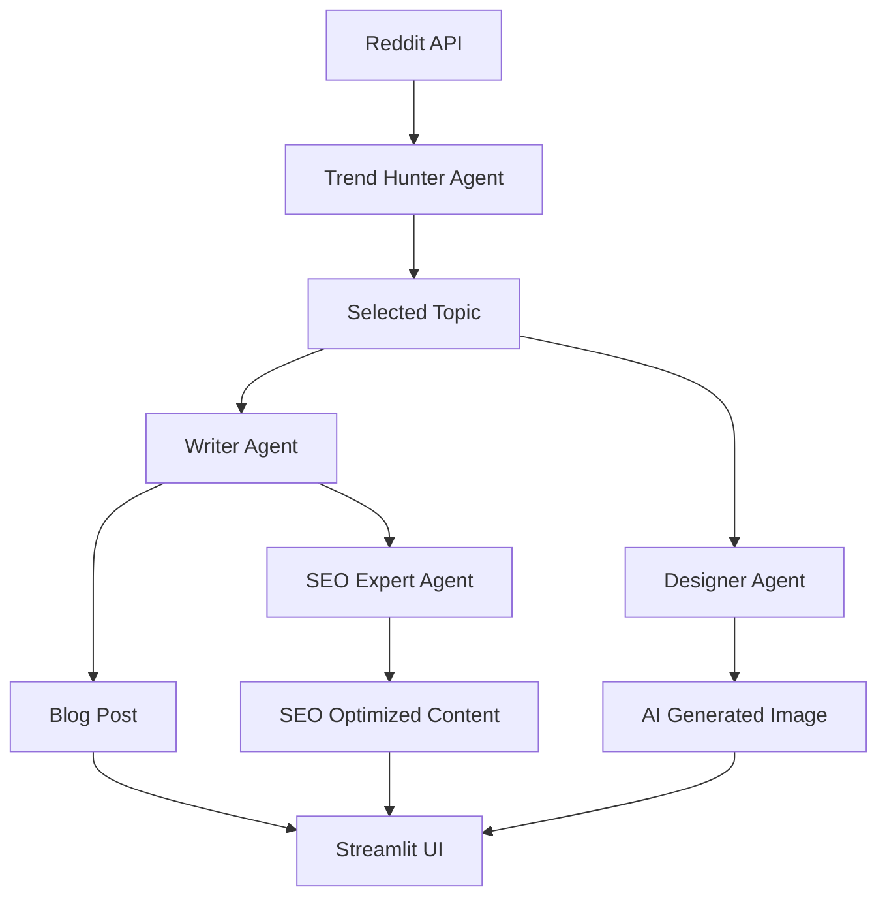

# 📈 Blog Agent - AI-Powered Content Creation Platform
## 🚀 Live Demo: [Click Here](https://blogagent-harsh-pilania.streamlit.app/)


> **Transform trending topics into professional content with the power of AI agents**

Blog Agent is an intelligent content creation platform that leverages multiple AI agents to automatically discover trending topics on Reddit, generate professional blog posts, optimize them for SEO, and create stunning AI-generated images - all in one seamless workflow.

## 🎯 Features

### 🔍 **Trend Hunter Agent**
- Scans Reddit subreddits for hot trending topics
- Extracts the top 5 most popular posts
- Real-time trend analysis

### ✍️ **Content Writer Agent** 
- Generates professional blog posts and LinkedIn content
- Creates well-structured articles with headings and subheadings
- Optimized for professional audiences

### 🎯 **SEO Expert Agent**
- Optimizes content for search engines
- Suggests relevant keywords and hashtags
- Improves content visibility and ranking

### 🎨 **Designer Agent**
- Creates AI image prompts for DALL-E
- Generates high-quality images (512x512)
- Perfect visual content for social media posts

## 🚀 Quick Start

### Prerequisites

- Python 3.8+
- Reddit API credentials
- OpenAI API key

### Installation

1. **Clone the repository**
```bash
git clone https://github.com/your-username/blog-agent.git
cd blog-agent
```

2. **Install dependencies**
```bash
pip install -r requirements.txt
```

3. **Set up environment variables**
Create a `.env` file in the root directory:
```env
REDDIT_CLIENT_ID=your_reddit_client_id
REDDIT_CLIENT_SECRET=your_reddit_client_secret
REDDIT_USER_AGENT=BlogAgent/1.0 by YourUsername
OPENAI_API_KEY=your_openai_api_key
```

### 🖥️ Running the Application

#### Option 1: Streamlit Web Interface (Recommended)
```bash
streamlit run stapp.py
```


#### Option 2: Command Line Interface
```bash
python run_app.py
```

## 📱 How to Use

### Web Interface (Streamlit)

1. **Enter Subreddit**: Type a subreddit name (e.g., "technology", "startup", "marketing")
2. **Fetch Topics**: Click "Get Trending Topics" to retrieve hot posts
3. **Select Topic**: Choose from the trending topics list
4. **Generate Content**: 
   - Create blog post with AI writer
   - Optimize for SEO with keyword suggestions
   - Generate AI images with DALL-E


### Command Line Interface

1. Enter the subreddit name when prompted
2. Select a trending topic from the displayed list
3. The system will automatically generate:
   - Professional blog post
   - SEO optimization
   - AI image prompt and image

## 🏗️ Architecture



## 🛠️ Technical Stack

| Component | Technology |
|-----------|------------|
| **Backend** | Python 3.8+ |
| **Web Framework** | Streamlit |
| **Reddit API** | PRAW (Python Reddit API Wrapper) |
| **AI Models** | OpenAI GPT-4o-mini, DALL-E 2 |
| **Configuration** | YAML, python-dotenv |
| **UI/UX** | Custom CSS, Responsive Design |


## 🔧 Configuration

### Reddit API Setup
1. Go to [Reddit Apps](https://www.reddit.com/prefs/apps)
2. Create a new application
3. Note down the client ID and secret
4. Add them to your `.env` file

### OpenAI API Setup
1. Visit [OpenAI API](https://platform.openai.com/api-keys)
2. Generate a new API key
3. Add it to your `.env` file

## 📝 Example Output

### Generated Blog Post
```
# The Future of Artificial Intelligence in Healthcare

## Introduction
Artificial Intelligence is revolutionizing the healthcare industry...

## Key Applications
- **Diagnostic Imaging**: AI algorithms can detect diseases...
- **Drug Discovery**: Machine learning accelerates...
- **Personalized Treatment**: AI enables tailored...

## Conclusion
The integration of AI in healthcare represents...
```

### SEO Optimization
- **Keywords**: AI healthcare, medical technology, diagnostic AI
- **Hashtags**: #HealthTech #AI #MedicalInnovation #DigitalHealth
- **Meta Description**: "Explore how AI is transforming healthcare..."

## 🚦 API Limits

| Service | Limit | Cost |
|---------|-------|------|
| OpenAI GPT-4o-mini | ~400-500 tokens per request | ~$0.0001-0.0002 |
| DALL-E 2 | 512x512 images | ~$0.018 per image |
| Reddit API | 60 requests per minute | Free |

## 🤝 Contributing

We welcome contributions! Please see our [Contributing Guidelines](CONTRIBUTING.md) for details.

### Development Setup
```bash
# Clone and setup
git clone https://github.com/your-username/blog-agent.git
cd blog-agent

# Install development dependencies
pip install -r requirements.txt
pip install -r requirements-dev.txt

# Run tests
pytest tests/
```

## 🐛 Troubleshooting

### Common Issues

**1. Reddit API Authentication Error**
- Verify your Reddit API credentials in `.env`
- Check if the user agent string is properly formatted

**2. OpenAI Rate Limits**
- Monitor your API usage on OpenAI dashboard
- Implement request delays if needed

**3. Streamlit Port Issues**
```bash
streamlit run stapp.py --server.port 8502
```

## 📄 License

This project is licensed under the MIT License - see the [LICENSE](LICENSE) file for details.

## 🌟 Acknowledgments

- [Reddit API (PRAW)](https://praw.readthedocs.io/) for trend data
- [OpenAI](https://openai.com/) for GPT and DALL-E models
- [Streamlit](https://streamlit.io/) for the web interface
- Community contributors and testers

## 📞 Support

- 🐛 **Bug Reports**: [Open an Issue](https://github.com/your-username/blog-agent/issues)
- 💡 **Feature Requests**: [Discussion Board](https://github.com/your-username/blog-agent/discussions)
- 📧 **Email**: support@blogagent.com

---

<div align="center">

**⭐ Star this repo if you find it helpful! ⭐**


</div>
